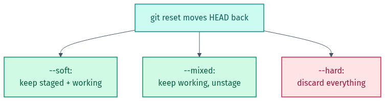

# Part 3 — History & Recovery

*What `git reset` touches — `--soft`, `--mixed`, `--hard`:*

<picture><source media="(prefers-color-scheme: dark)" srcset="../docs/04-reset-types-dark.png"></picture>

## 🎯 Goal
Learn the "senior engineer" moves: tidy up messy history before sharing it, find exactly which commit broke something, and rescue work you thought was gone.

## 🧠 What you practise here
- Rewriting recent history with an interactive rebase (squash + reword)
- Finding the commit that introduced a bug with `git bisect`
- Recovering a "lost" commit with `git reflog`

---

## 📝 The 3 scenarios

| # | File | What you practise |
|---|------|-------------------|
| 1 | `scenario-1-interactive-rebase.md` | squashing & rewording commits |
| 2 | `scenario-2-bisect.md`             | finding a bad commit automatically |
| 3 | `scenario-3-reflog-recover.md`     | rescuing a lost commit with reflog |

Each scenario works on a ready-made repo under `sandbox/`. Run `python setup.py` from the lab root first (and any time you want to start over).

Step-by-step answers are in [`solutions/`](solutions).

🎉 Finished all three parts? You now know the Git moves that come up most in real work and in interviews. Go back to the [main README](../README.md) and share your fork on LinkedIn!

---

## ⭐ Found this useful?
Please **star** ⭐, **fork** 🍴, and **share** 🔗 this repo on LinkedIn so others can use it too. Want to add a scenario or fix something? See [CONTRIBUTING.md](../CONTRIBUTING.md).

Made by **Shubham Sharma** · [GitHub](https://github.com/shubhs248) · [LinkedIn](https://www.linkedin.com/in/shubhs248)
