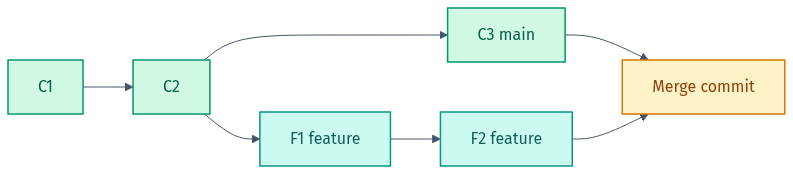
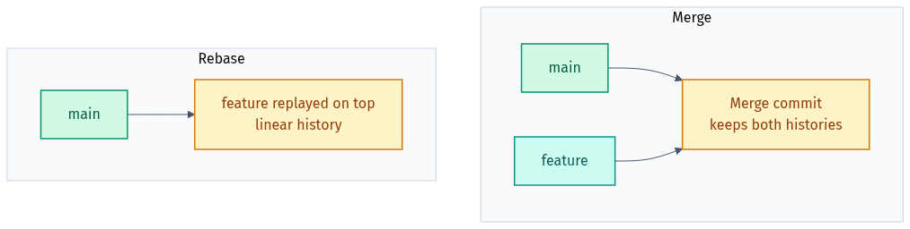

# 🖼️ Diagram Gallery — Git Scenarios

Rendered diagrams for this lab in **light + dark**. They adapt to your GitHub theme below; grab the files directly for slides or LinkedIn.

- Light: `NN-name.png` / `.svg` · Dark: `NN-name-dark.png` / `.svg`
- Editable Mermaid source lives in [`src/`](src). Re-render from the repo root with `render-diagrams.ps1`.

## 🎨 Colour legend
| Colour | Means |
|--------|-------|
| 🔵 Cyan | start / commit |
| 🟢 Teal / Green | local areas & actions |
| 🟠 Amber | repo / result |
| 🔴 Rose | destructive (`--hard`) |

---

### The three areas (+ remote)
Working directory → staging → local repo → remote. Knowing where your changes live explains every Git command.

<picture><source media="(prefers-color-scheme: dark)" srcset="01-git-areas-dark.png"></picture>

### Branching and merging
<picture><source media="(prefers-color-scheme: dark)" srcset="02-branching-dark.png"></picture>

### Merge vs rebase
<picture><source media="(prefers-color-scheme: dark)" srcset="03-merge-vs-rebase-dark.png"></picture>

### git reset: soft vs mixed vs hard
<picture><source media="(prefers-color-scheme: dark)" srcset="04-reset-types-dark.png"></picture>

---

Made by **Shubham Sharma** · [GitHub](https://github.com/shubhs248) · [LinkedIn](https://www.linkedin.com/in/shubhs248)
